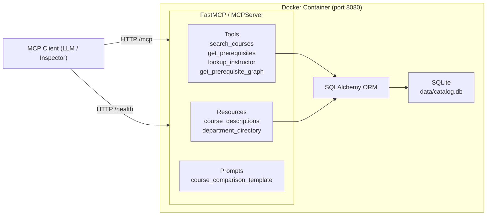

# University Course Catalog MCP Server

An MCP (Model Context Protocol) server that exposes a university course catalog as a set of tools, resources, and prompts. The intended consumer is an AI academic advisor — a language model that needs to answer questions about courses, prerequisites, and instructors without hallucinating data. The server gives that model a structured, queryable interface backed by a real database.

---

## Architecture



---

## Tech Stack

| Component | Library / Tool |
|---|---|
| Language | Python 3.12 |
| MCP layer | `mcp` 2.0.0 (MCPServer, streamable-http transport) |
| ORM | SQLAlchemy 2 |
| Validation | Pydantic v2 |
| Graph traversal | NetworkX |
| Database | SQLite |
| Container | Docker + Docker Compose |

---

## Project Structure

```
.
├── README.md
├── Dockerfile
├── docker-compose.yml
├── .dockerignore
├── .env.example
├── .gitignore
├── requirements.txt
├── data/
│   ├── catalog.db          # seeded SQLite file, committed to git
│   └── seed.py
├── src/
│   ├── __init__.py
│   ├── main.py             # MCPServer instance, health route, entrypoint
│   ├── database.py         # SQLAlchemy engine/session/Base
│   ├── models.py           # Department, Instructor, Course, Prerequisite ORM models
│   ├── schemas.py          # Pydantic input/output models for all 4 tools
│   ├── tools.py            # tool implementations
│   ├── resources.py        # course_descriptions / department_directory
│   └── prompts.py          # course_comparison_template
└── scripts/
    └── verify_server.py    # repeatable smoke-test script
```

---

## Setup & Run

### Docker (recommended)

```bash
docker compose up --build
```

The server starts on port 8080. The MCP endpoint is at `http://localhost:8080/mcp`, health check at `http://localhost:8080/health`.

### Local dev

```bash
python3 -m venv .venv
source .venv/bin/activate
pip install -r requirements.txt

# Seed the database (idempotent — safe to run multiple times)
python data/seed.py

# Start the server
python src/main.py
```

The server reads `DATABASE_URL` from the environment. Copy `.env.example` to `.env` if you want to override the default (`sqlite:///./data/catalog.db`).

---

## Database Schema

### departments

| Column | Type | Constraints |
|---|---|---|
| id | INTEGER | PRIMARY KEY |
| name | TEXT | NOT NULL |
| code | TEXT | NOT NULL, UNIQUE |

### instructors

| Column | Type | Constraints |
|---|---|---|
| id | INTEGER | PRIMARY KEY |
| name | TEXT | NOT NULL |
| email | TEXT | NOT NULL |
| office | TEXT | |
| department_id | INTEGER | NOT NULL, FK → departments.id |

### courses

| Column | Type | Constraints |
|---|---|---|
| id | INTEGER | PRIMARY KEY |
| course_code | TEXT | NOT NULL, UNIQUE |
| title | TEXT | NOT NULL |
| description | TEXT | NOT NULL |
| credits | INTEGER | NOT NULL |
| instructor_id | INTEGER | NOT NULL, FK → instructors.id |
| department_id | INTEGER | NOT NULL, FK → departments.id |

### prerequisites

| Column | Type | Constraints |
|---|---|---|
| course_id | INTEGER | PRIMARY KEY, FK → courses.id |
| prerequisite_id | INTEGER | PRIMARY KEY, FK → courses.id |

---

## MCP Tools

| Name | Purpose | Input | Output |
|---|---|---|---|
| `search_courses` | Case-insensitive substring search over course title and description | `query: str`, `department_code: str \| None` | `[{course_code, title, credits}, ...]` — empty list if no matches |
| `get_prerequisites` | Returns direct prerequisites (one level) for a course | `course_code: str` | `{course_code, prerequisites: [{course_code, title}]}` or `{error}` |
| `lookup_instructor` | Returns contact and department info for an instructor by name | `instructor_name: str` | `{name, email, department_name}` or `{error}` |
| `get_prerequisite_graph` | Builds a full transitive prerequisite graph using NetworkX | `course_code: str` | `{nodes: [{id}], edges: [{source, target}]}` or `{error}` |

---

## MCP Resources

| Name | URI | Content |
|---|---|---|
| `course_descriptions` | `catalog://course_descriptions` | One line per course: `[CS101] Introduction to Programming: <description>` |
| `department_directory` | `catalog://department_directory` | One line per department: `Computer Science (CS)` |

Both resources are generated dynamically from the database on each read.

---

## MCP Prompts

| Name | Description |
|---|---|
| `course_comparison_template` | A comparison table template with literal `{{course_code_1}}` and `{{course_code_2}}` placeholders for two courses |

Template text:
```
Create a table comparing the following two courses: {{course_code_1}} and {{course_code_2}}. Include columns for Title, Credits, Description, and Prerequisites.
```

---

## Example Queries

These are the kinds of natural-language questions a connected LLM could answer using the tools above:

1. "What courses do I need to take before I can enroll in Artificial Intelligence (CS401)?"
2. "Show me all the courses offered by the Mathematics department."
3. "How do I contact Dr. Sarah Chen, and what department is she in?"
4. "I want to take Database Systems — what's the full chain of prerequisites I need to complete first?"
5. "Compare Introduction to Programming and Calculus I — what are the differences in credits and content?"

---

## Design Note: MCPServer over FastAPI

The server uses `MCPServer` from the MCP Python SDK directly, running with `transport="streamable-http"`. I did not mount the MCP app inside a separate FastAPI application. Doing so (via FastAPI's `.mount()` applied to `mcp.streamable_http_app()`) is a known routing bug in older SDK releases where the MCP endpoint stops responding correctly after mounting. Using `MCPServer.run()` with its built-in Uvicorn runner avoids the issue entirely — the health endpoint is added with `@mcp.custom_route("/health")`, which registers it on the same Starlette app that MCPServer manages internally. One port, one process, no wrapper.

---

## Verification

Run the smoke-test script against a locally running server:

```bash
python src/main.py &
python scripts/verify_server.py
```

The script uses the MCP Python client library directly (no shelling out to the inspector) and prints real JSON results for all tools, both resources, and the prompt template.
